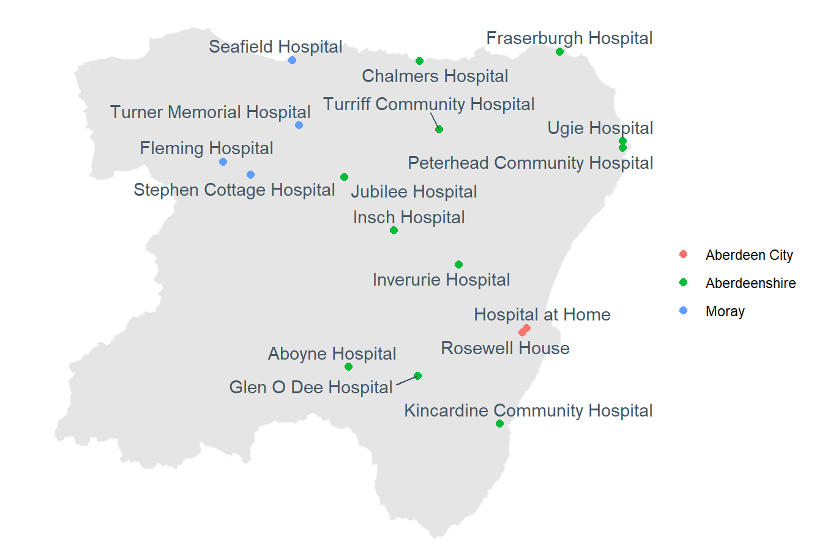

```{r setup, include=FALSE}
knitr::opts_chunk$set(echo = FALSE)
```

#### Community healthcare centres were used by GPs to keep people out of hospital. 

#### Now these community beds hold older, more seriously ill patients recovering from hospital or waiting to be discharged.

#### Where should the lost preventative care be delivered?

<br>
<br>
The [Scottish Government states](https://www.gov.scot/publications/maximising-recovery-promoting-independence-intermediate-care-framework-scotland/)  

>We must deliver person-centred **community-based services** that will help people to live healthy, independent lives in the way they want, where they want, and when they want.  

>**Intermediate Care** can help shift the balance of care away from hospital and can reduce the need for alternative, longer-term care services, such as home care, or permanent admission to a care home.  

<br>

Across Scotland, GPs provide intermediate care in community-based, intermediate-tier care centres (generally called community hospitals in NHS Grampian).  

Their goals are 1) to prevent admissions to hospital, or 2) to shorten stays in hospital by providing recovery care.  

**We asked these questions**

- Who receives care in community settings in NHS Grampian?  
- How much care is for people coming from hospitals to recover?  
- How much care is for people coming from home?  
- What are the medical needs of the patients?  
- How has intermediate care changed over time?  
- Are there differences across locations?  

<br>



<br>

**We found that in the past five years, care in intermediate centres has shifted dramatically – from preventative care overseen by GPs, to care of more older and seriously ill patients transferred from hospital.** 

We analysed all people age 50+ who were admitted to any of the 17 intermediate care settings in NHS Grampian from 2019-2023 (13,000 people total). For each patient, we linked their medical records from inpatient, outpatient and emergency admissions, and GP prescribing over the previous ten years. We then measured 1) intermediate care use; 2) patient pathways into intermediate care, and 3) differences in care use and pathways into care by: medical acuity, demographics, and between urban and rural care settings.  

There were 24,000 admissions to intermediate care in the five-year study period. The patient population changed substantially:  

- In 2019, 68% of patients were referred by primary care or receiving scheduled day-case care. Five years later, 55% of patients were stepping down from the acute hospitals.  

- Between 2019 and 2023 admissions dropped by 40%, but the average length of stay increased steeply. In 2023, median length of stay was 3 weeks, with 22% of step-down patients staying over 6 weeks.  

- Over just five years, the patient population became older, with the proportion over 80 rising from 40% to 52%, and more acutely ill, with higher morbidity and polypharmacy scores, and more diagnoses of delirium or dementia.  

- Many intermediate care patients were near the end of life – 15% of patients died during their stay, and 21% died within 90 days of being discharged.  

## Summary

Our key finding is that since 2019, NHS Grampian’s community care settings changed from providing short-term, preventative care, to providing long-term post-acute care.  

Key policy questions follow:  
Are these care centres the right settings for step-down and end-of-life care? If so, where should the lost preventative and scheduled care take place?  

We note that in order to proactively plan a balance of preventative and acute care, more data sharing is required. Though intermediate care is delivered by Health and Social Care Partnerships in Scotland, patient data are not shared between the primary and secondary care, nor with social care. No true integrated care can take place until data for the entire patient journey can be linked.  


	
### Tell me more

This research was done as part of the [Networked Data Lab](https://www.health.org.uk/reports-and-analysis/briefings/are-intermediate-care-services-stretched-too-thin) with partners at The Health Foundation.  

[Frank Popham](https://www.frankpopham.com/) led this analysis with me. Other contributors were: Corri Black, Corri Black, Raul Berrocal-Martin, Sharon Gordon, Kate O'Sullivan, Helen Rowlands, Bernhard Scheliga, Irmina Zborowska, and the NHS Grampian Public Health
– Health Intelligence Team.  

Policy recommendations from our work are in the briefing [Are intermediate care services stretched too thin?](https://www.health.org.uk/reports-and-analysis/briefings/are-intermediate-care-services-stretched-too-thin). Please see the appendices therein for more details.

